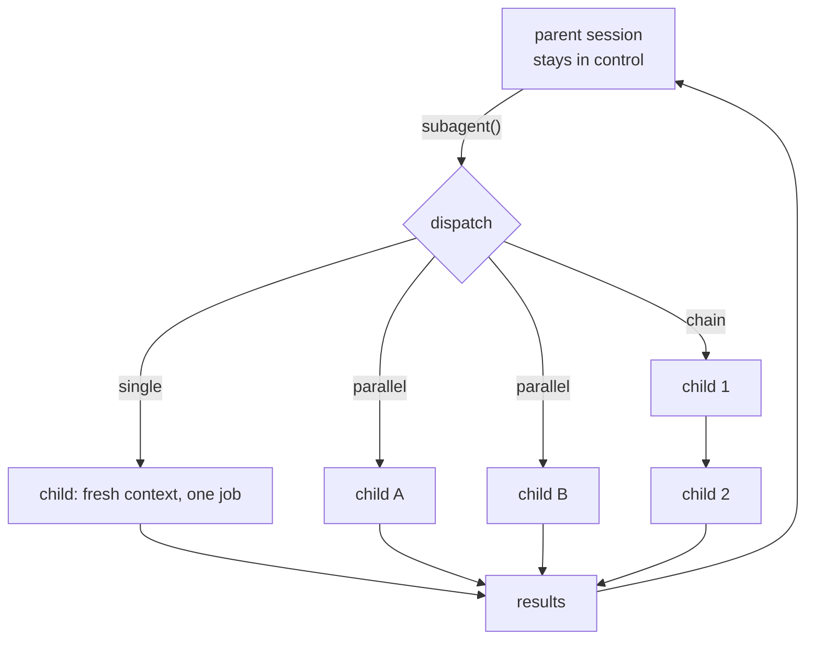

<p align="center">
  
</p>

# pi-cohort

[](https://buymeacoffee.com/jjurasszek)

Coordination for the [pi coding agent](https://github.com/earendil-works/pi): one parent agent delegates to focused child agents.

## The problem

A single agent reviewing its own work is theater - it shares the blind spots that produced the bug in the first place. And one agent can't hold a large task, a plan, and three parallel audits in one context without drift: the further into a task it gets, the more the earlier decisions blur.

`pi-cohort` gives the parent agent a `subagent()` tool to delegate to focused child agents, each with its own fresh context and one job. The parent stays in control and brings results back - a team with one orchestrator, not a swarm.

## Why this is different

- **Fresh eyes, not the same model talking to itself.** A reviewer child has no stake in the code it's checking and no memory of writing it.
- **The parent stays in control.** Children don't spawn their own children unless explicitly allowed (`tools: subagent`), and nesting is depth-capped - no runaway fanout.
- **Delegation is a tool call, not a mode switch.** You keep talking to Pi normally; it decides when a task benefits from a second set of eyes, a parallel scout, or a background run.

## Part of the pi agent toolkit

Four independent extensions for the [pi coding agent](https://github.com/earendil-works/pi), each owning one concern of running agents seriously:

- [pi-quiver](https://github.com/jjuraszek/pi-quiver) - capabilities (fetch, doc conversion, session tools)
- **pi-cohort - coordination (delegate to focused child agents)**
- [pi-condense](https://github.com/jjuraszek/pi-condense) - context economy (prune context, keep it recoverable)
- [pi-gauntlet](https://github.com/jjuraszek/pi-gauntlet) - process (the gated brainstorm->ship workflow)

[pi-gauntlet](https://github.com/jjuraszek/pi-gauntlet) has a hard runtime dependency on this package - its personas dispatch through `subagent()`. The rest are complementary, not required.

## Installation

```bash
pi install npm:pi-cohort
```

That is the only required step.

## Mental model

Pi is the parent session. A subagent is a focused child Pi session with its own job. When you ask for a subagent, Pi starts the child, gives it the task, and brings the result back. Foreground runs stream in the conversation; background runs keep working and can be checked later.

Installing the extension does not start an automatic reviewer in the background - it gives Pi a delegation tool. If you want every implementation reviewed, say so in your prompt or project instructions:

```text
When you finish implementing, run a reviewer subagent before summarizing.
```



## Quick example

You do not need to create agents, write config, or learn slash commands. After installing, ask Pi for delegation in plain language:

```text
Use reviewer to review this diff.
```

```text
Ask oracle for a second opinion on my current plan.
```

```text
Run parallel reviewers: one for correctness, one for tests, and one for unnecessary complexity.
```

That's the whole surface for day-to-day use. More phrasing patterns: [doc/commands.md](doc/commands.md#prompt-cookbook-appendix).

## Architecture

`subagent()` supports four dispatch shapes, all through the same tool:

| Mode | Use it for |
|---|---|
| Single | One focused child: review a diff, scout a codebase, plan a change. |
| Parallel | N children at once, e.g. three reviewers with different angles. |
| Chain | Sequential steps where each agent's output feeds the next (`scout -> planner -> worker -> reviewer`). |
| Async | Any of the above, backgrounded, so the parent keeps working or ends its turn cleanly. |

`context: "fork"` starts a child from a real branched session instead of a fresh one, when it needs the parent's history. Cost across the whole subtree - main loop plus every foreground/background/nested child - rolls up into one `Σ$` total in the footer; see [doc/observability.md](doc/observability.md).

Full reference: agent/chain authoring in [doc/agents-and-chains.md](doc/agents-and-chains.md), exact command syntax in [doc/commands.md](doc/commands.md), the raw tool API in [doc/programmatic-api.md](doc/programmatic-api.md).

## Key concepts

| Term | Meaning |
|---|---|
| Subagent | A focused child Pi session with one job and (by default) a fresh context. |
| Agent (persona) | A markdown file with frontmatter defining a specialist: `scout`, `planner`, `worker`, `reviewer`, `context-builder`, `oracle`, `delegate`. Full table: [doc/agents-and-chains.md](doc/agents-and-chains.md#builtin-agents-in-plain-english). |
| Chain | A saved or inline sequence of agent steps, with fan-out/fan-in support. |
| Fresh vs. forked context | Fresh = clean slate; forked = a real branch of the parent's session history. |
| Recursion guard | Depth cap on nested delegation so a child can only fan out if explicitly allowed. |
| `Σ$` / `cost:external` | The session-wide cost rollup, and the protocol other extensions use to report into it. |

## When to use / when NOT to use

**Use it for:** code review with a second set of eyes, parallel audits (correctness/tests/complexity as separate passes), scoping/planning before a bigger change, background work that shouldn't block the main conversation.

**Don't use it for:** a trivial single-shot edit - the delegation overhead isn't worth it. It's also not an always-on background reviewer; nothing runs automatically unless you or your project instructions ask for it.

## Configuration

Most installs need zero configuration. Full env/JSON reference: [doc/configuration.md](doc/configuration.md).

Optional companions:

- [pi-intercom](https://github.com/jjuraszek/pi-intercom) - lets a blocked child ask the parent a question instead of guessing. [doc/skills-and-companions.md](doc/skills-and-companions.md#optional-pi-intercom-companion)
- [pi-essentials](https://github.com/jjuraszek/pi-essentials) - lets `context-builder` read referenced URLs. [doc/skills-and-companions.md](doc/skills-and-companions.md#optional-pi-essentials-companion)

## Deeper reference

- [doc/agents-and-chains.md](doc/agents-and-chains.md) - builtin agents, frontmatter, overrides, chain files and variables
- [doc/commands.md](doc/commands.md) - exact slash-command syntax, prompt cookbook
- [doc/programmatic-api.md](doc/programmatic-api.md) - the raw `subagent()` tool parameters
- [doc/configuration.md](doc/configuration.md) - all settings keys
- [doc/observability.md](doc/observability.md) - where runs show up, cost tracking, events
- [doc/skills-and-companions.md](doc/skills-and-companions.md) - skills injection, bundled skill, optional companions
- [doc/orchestration-patterns.md](doc/orchestration-patterns.md) - recommended loop, acceptance gates, worktree isolation, recursion guard

## Relationship to the other repos

`pi-gauntlet`'s gated workflow runs its planner/implementer/reviewer personas through this package's `subagent()` - without pi-cohort, gauntlet has no dispatch mechanism. `pi-condense` reports its own summarization spend through the `cost:external` protocol this package aggregates into `Σ$` (see [doc/observability.md](doc/observability.md)). `pi-quiver` has no code coupling here.

## Roadmap

See [CHANGELOG.md](CHANGELOG.md) for shipped work in progress.

## Support

If `pi-cohort` is useful, consider [buying me a coffee](https://buymeacoffee.com/jjurasszek).
